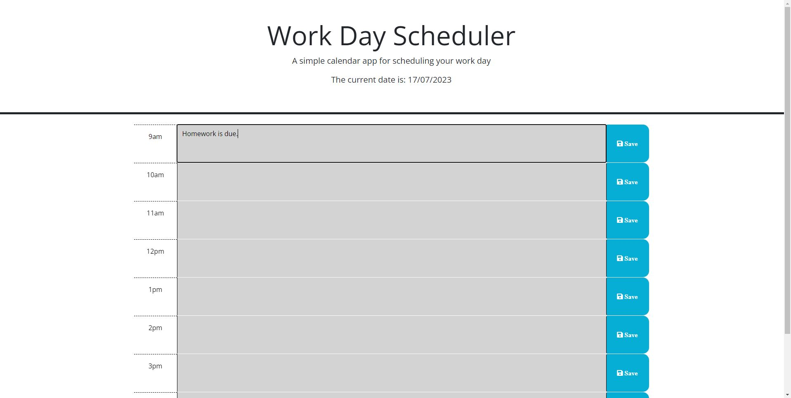

# work-day-scheduler

## Description

This web application was created to help the user stay organised, by being able to update this day-to-day schedule. The user can put events into the schedule and the time blocks change colours to display the current time relative to the schedule. Throughout this project I learnt the importance of third-party APIs in simplifying coding tasks.

## Usage

To use this web application the user is to click on the time slot that is desired and type in the event they would like to be reminded of. Once they have typed the required event they will then click the save button to the right of the time slot and that will save that event to the local storage. The user can close the window containing the schedule and when it is reopened the shedule will still have the saved events available for viewing.

